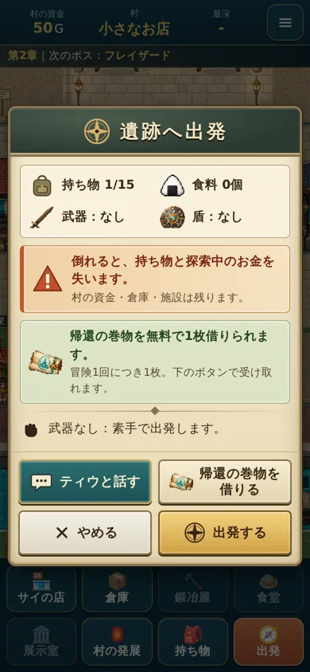
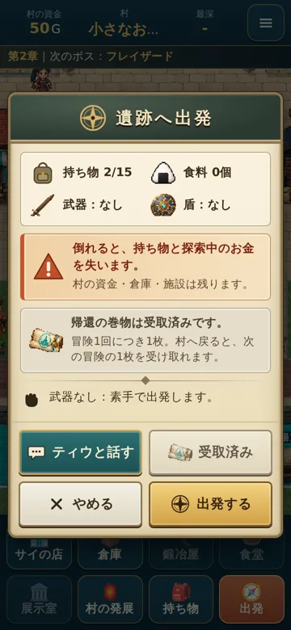

# 遺跡へ出発の画面と、帰還の巻物の無料の貸し出し（2026年10月）

デザイン案は `docs/depart-v1/design-reference.png` です（ChatGPT のデザイン、革・古紙・金属）。
実装はCSSで、`css/style.css` の「遺跡へ出発」と `js/ui.js` の `openDepart` にあります。

## 画面
- **見出し:** 濃い緑の革に、金の文字と羅針盤。
- **本文:** 古紙。
  - 持ち物・食料・武器・盾の表。アクセサリーを着けているときは、横長の1行を足します。
  - 注意の欄（倒れると失うもの）。
  - 帰還の巻物の欄。
  - 料理と素手の注意。
- **ボタン:** 2列で、並びは固定です。

  | | |
  |---|---|
  | ティウと話す | 帰還の巻物を借りる／受取済み |
  | やめる | 出発する |

  - 21階から出発（大魔王のローブ）は、使えるときだけ、その上に横長で出します。
  - おにぎりの貸し出しのボタンは出発画面には出しません（サイの店で借りられます）。
- **アイコン**
  - おにぎり・剣・盾・巻物：ゲームの道具の絵です。
  - 羅針盤・注意・かばん・吹き出し・×・フォーク・こぶし：仮の簡単な線の絵です。完成の素材が届いたら差し替えます。
- **ティウと話す:** 町のティウ本人と同じ「ティウの冒険案内」を開きます（`docs/TIW_GUIDE.md`）。閉じると出発画面に戻ります。

## 帰還の巻物（`G.scrollStatus`・`G.takeReturnScroll`）
- 1回の冒険（出発から村へ戻るまで）につき、無料で1枚だけです。受け取りは任意で、借りずに出発できます。
- 受け取ると、ボタンは「受取済み」になって押せなくなります（`V.scrollTaken`）。
  - 閉じる・開き直す・読み込み直しでは戻りません。
  - 巻物を手放しても、同じ準備中は再び出しません。もともと倉庫・売却はできません。
- 持ち物がいっぱいのときは、押すと「1枠空けると受け取れます」と出ます。受取済みにはしないので、空きを作れば受け取れます。
- 冒険を終えて村へ戻ると（帰還でも敗北でも、`G.finishRun`）、次の冒険の1枚を受け取れます。
- 出発のときの自動の支給はやめました（二重に配りません）。持ち物がいっぱいでも出発できます。
- 連打しても1枚だけです（閉じたあとのボタンは受けつけません）。

## 確認（PCのブラウザで幅360・390・430、`tools/depart-check.js` 39項目）
- ボタンの並び、はみ出さないこと、ボタンが押しやすい大きさであること。
- 受け取り（連打）と「受取済み」。
- 閉じる・開き直す・読み込み直しで、状態が戻らないこと。
- 手放しても再び出さないこと。出発で二重にならないこと。
- 村へ戻ると次の1枚が受け取れること。
- 持ち物がいっぱいのときの扱いと、空きを作ったあとに受け取れること。
- 借りずに出発できること。
- ロジックのテスト（`tests/logic.test.js`）とブラウザのテスト（`tests/e2e.test.js`）も、借りてから出発するように直しました。

 
