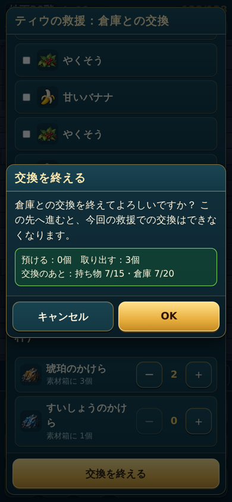
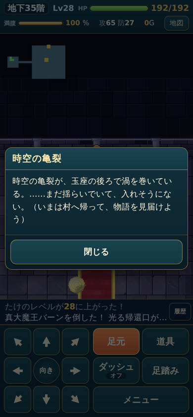

# 最終章（版3）・竜の装備セット・ティウの救援

ChatGPT の「最新の回答・実装指示」（1〜14）のうち、**確定した部分だけ**を実装した記録。保留の項目は、勝手に決めずに仮の扱いにしている（下の「保留・仮の扱い」）。

## 最終章の流れ（版3、`D.LAYOUT = 3`）

### 本編（初回）
| 階 | できごと |
|---|---|
| 30階 | 大魔王バーン。撃破 → ミストバーンが連れ去る（`vearnTaken`）→ 玉座の後ろに下り階段 → ローブ（初回のみ）→ ティウの救援（回復・倉庫との交換）→ 31階へ。**村への帰還口は出ない** |
| 31〜34階 | 普通に探索（自動で飛ばさない） |
| 35階 | ボス部屋に入る → 体が戻る場面（`bodyReturn`）→ サイたちの祈り → 真大魔王バーン → 帰還口とエンディング。玉座の後ろに**時空の亀裂**が残る |

### クリア後の再探索
- 30階・35階は、ボスがいなくても玉座の間の形のままです。
- 30階：大魔王バーンは出ません。玉座の後ろの階段から31階へ。ティウの救援もありません。
- 35階：真大魔王バーンは出ません。時空の亀裂（玉座の後ろ）と、前室に帰還の祠があります。
- 時空の亀裂の状態は `G.crackState` で決めます。
  - `none`：真大魔王バーンを倒す前。亀裂は無く、36階へは進めません。
  - `unstable`：初めて倒した直後で、エンディングの前。入れません（**判断待ち**）。
  - `notReady`：クリア後。36〜40階がまだ無いので「準備中」と出ます。
  - `open`：`D.POSTGAME_FLOORS` ができたら、36階へ進めます。
- 亀裂は仮の絵です（黒紫の裂け目がゆらぐ）。完成の絵はChatGPT側です。
- 「玉座の後ろ」は、玉座の間の奥の壁ぎわ・絨毯の先のマスです（`G.throneBack`）。

### 回復（30階の救援・35階の祈り）
- HPと満腹度を、それぞれ今の最大値まで回復します。毒と拘束は治ります。最大値そのものは増えません（`G.fullRecover`）。
- **救援:** `G.beginRescue` で1回だけです（`run.final.rescueHealed`）。画面を開き直したり、読み込み直したりしても重なりません。
- **祈り:** 戦いの開始と同じ1回だけです（`bossFight.engaged`）。登場の場面の途中で読み込み直しても重なりません。

## ティウの救援：倉庫との交換
1. **選ぶ**
   - 預ける：持ち物の品。装備中の品も預けられ、預けると外れます。能力とセットは計算し直します。
   - 取り出す：倉庫の品と、素材箱の素材（個数を ＋／− で選ぶ）。
   - 選んだ内容は**仮の交換予定**として `run.final.rescuePlan` に保存します。読み込み直しても残ります。
   - この段階では、品はまだ動きません。何度でも選び直せます。
2. **「交換を終える」**
   - 「倉庫との交換を終えてよろしいですか？ この先へ進むと、今回の救援での交換はできなくなります。」と確認します。
   - キャンセルなら選ぶ画面へ戻ります。
3. **OK（`G.commitRescue`）**
   - 持ち物15個・倉庫の枠を確かめ直してから、一括で交換し、救援を終えてすぐ保存します。
   - 容量をこえるときは何も動かさず、選ぶ画面へ戻ります（救援は続きます）。
   - 連打しても1回だけです。
4. **オオカミが届ける演出**
   - 今は文字だけの仮の表示です（`run.final.wolf`）。読み込み直したら演出だけ出し直し、交換は二重になりません。
   - 「進む」のあと、31階へ進めます。救援が終わるまでは、階段を降りられません。
- 確定したあとは、同じ挑戦の中ではもう交換できません。

### 素材の扱い
- 素材は、探索中は持ち物の1個1枠です。村では素材箱（`V.materials`、個数だけ）にあり、倉庫の枠は使いません。
- 救援でも、帰ったときと同じ扱いにしました。
  - 預けた素材は素材箱の個数に足します。
  - 取り出した素材は1個ずつ持ち物に入ります。
- 個数は変わらず、管理の仕方も変えていません。
- 送れないのは、倉庫に入れられない品（帰還の巻物・貸出品）だけです。

## 竜の装備

| 品 | 種類 | 入手 |
|---|---|---|
| 真魔剛竜剣 `shinma_sword` | 武器 | 通常のバラン（第4章の報酬） |
| 竜の紋章（お宝） `baran_emblem` | お宝（飾り） | 通常のバラン（第4章の報酬）。装飾品とは別の品 |
| ドラゴニックオーラの盾 `dragonic_shield` | 盾 守り22（鍛冶で+8まで） | 竜人王バラン（未実装）の予定 |
| 竜の紋章 `dragon_crest` | 装飾品 攻撃+5 | 赤い橋の向こう岸で拾う（位置は仮） |

- 赤い橋は**通常のバランを倒したあと**に建てられる（900G のまま）。
- ティウのヒント：出発の画面の「ティウと話す」。橋ができる前から、紋章を拾うまで聞ける。橋を建てると仮の場面（`bridge`）。

### セット

| 組み合わせ | 効果 |
|---|---|
| 剣＋紋章 | 攻撃+5（装備だけで 24+5+5=34） |
| 剣＋盾 | 正面2マス目まで届く。手前の敵を貫通して2体まで。壁・角はこえない。戦いの前で待っているボス・商人には届かない。「バシュン！」（仮の文字の演出） |
| 紋章＋盾 | 守り+5 |
| 3点 | 上のすべて＋2回行動・飛んでいる見た目（仮：少し浮く）・ボスの床の印のダメージを受けない・新しい毒と拘束を受けない |
| 漆黒の盾＋大魔王のローブ | 満腹度が減らない。自然回復は2倍のまま（4倍にはならない）。攻撃は合計の0.8倍（**四捨五入**、`Math.round`）。真魔剛竜剣を**武器として装備しているときだけ**減らない（持ち物・倉庫にあるだけでは減る） |
| 大魔王のローブ | 自然回復2倍（毒・満腹度0のときは回復しない、今まで通り） |

### 紋章の身代わり

HPが0になると紋章が消えて、最大HPの50%で生き返る（`Math.max(1, Math.round(最大HP×0.5))`。3点セットなら全回復）。紋章が消えた時点でセットは計算し直し（2回行動・攻撃+5・守り+5 は消える）。

### 2回行動（3点セット）

- たけの2行動で、敵1回・時間（自然回復・満腹度・毒・敵の出現）1ターン。ターンを使わない操作（見る・メニューなど）は数えない。
- 判定は「その行動の**前**に3点セットだったか」。1回目のあとは `player.half = 1`。2回目のあと（または3点セットでない状態で行動したとき）に敵の手番と時間が進む。
- テストで確かめた行動順（1：1ターン進んだ、0：進まない、E：敵が動いた、h：1回目の途中）

| 行動 | 結果 |
|---|---|
| 待つ（セットなし） | 1E |
| 紋章を着ける（セットなしの行動） | 1E |
| 待つ（3点：1回目） | 0h |
| 待つ（2回目） | 1E |
| 紋章を外す（3点のまま1回目） | 0h |
| 待つ（もう3点ではない → 保留の1ターン） | 1E |
| 待つ | 1E |
| 紋章を着ける → 待つ（1回目）→ 紋章を外す（2回目） | 1E → 0h → 1E |
| すぐ着け直す（セットなしの行動） | 1E |

- 3点のまま10行動で、敵5回・5ターン。付け外しで行動は増えず、敵の手番も消えない。
- **紋章の身代わり:** 倒されるのは敵の手番の中（2回目のあと）なので、その手番は消えない。紋章が消えてセットが外れ、次の行動からは1行動＝1ターン（記録：「1回目：0h」「2回目（倒れて復活）：1」→ 次：1）。
- 1回目の行動のあとに階を移ると `half` は0に戻る（新しい階は数え直し）。

## ムービー

`playStoryMovie(名前, 次へ)`：動画（`TS.ASSETS.movies[名前]`）があれば動画、無ければ `D.STORY.movieFallback[名前]` の仮の会話（「（ムービー準備中）」つき）。最後まで見た・スキップ・読み込み失敗のどれでも「次へ」を1回だけ呼ぶ。見た記録は `story.moviesSeen`。報酬や進行はムービーの前にゲーム側で決まっているので、二重にもらえることも、見ないと進めないこともない。

| 名前 | 場面 |
|---|---|
| `baranTaken` | 通常のバラン撃破 → ミストバーンが連れ去る |
| `vearnTaken` | 30階・大魔王バーン撃破 → ミストバーンが連れ去る |
| `bodyReturn` | 35階に入ったとき：体が戻る → ミストの影が裂け目へ逃げる |
| `bridge` | 赤い橋の完成（ヒント） |

## 保留・仮の扱い（決めていない）

- 30階の救援での回復量（今は回復しない）／交換の回数（今は「終わる」まで何度でも）
- 35階の祈りで満腹度を戻すか（今は戻さない）
- 36〜40階・竜人王バラン・特別な素材・裂け目の道・鯉の無限強化・商人での買い直し：**未実装**
- 持っているかの判定に倉庫を含めるか／紋章を拾う位置と回想／橋を建てる条件の品／セットができたときに今の状態異常を治すか
- ドラゴニックオーラの盾・お宝の竜の紋章の売値（今は売れない）

## 今のゲームとの食い違い

- ダンジョンには水などの地形が無いので、「水の上を飛ぶ」は今は効果が出ない。
- 床の罠は無い（ボスの床の印だけ）。「罠・床のダメージを受けない」はボスの床の印に効く。
- たけの状態異常は毒と拘束だけ。

## 確認

- `node tests/logic.test.js`、`node tests/e2e.test.js`（最終章の版3の流れ・救援の交換と読み込み直し・35階の祈り）
- `node tools/final-v3-check.js`（幅360・390・430：救援の画面・飛ぶ見た目・体が戻る場面・祈り）、`tools/pendant-check.js`、`tools/boss-equipment-check.js`、`tools/movie-check.js`

   
