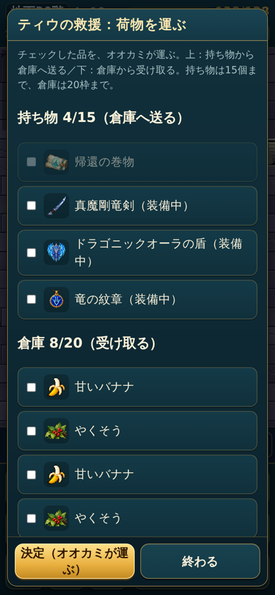
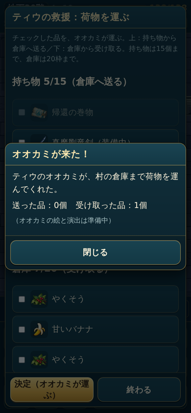
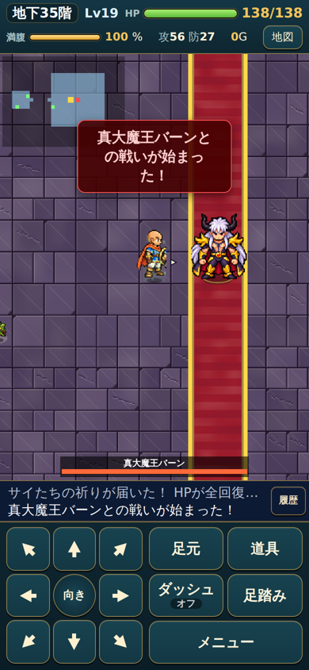

# 最終章（版3）・竜の装備セット・ティウの救援

ChatGPT の「最新の回答・実装指示」（1〜14）のうち、**確定した部分だけ**を実装した記録。保留の項目は、勝手に決めずに仮の扱いにしている（下の「保留・仮の扱い」）。

## 最終章の流れ（版3、`D.LAYOUT = 3`）

| 階 | できごと |
|---|---|
| 30階 | 大魔王バーン。撃破 → 連れ去る場面（`vearnTaken`）→ 大魔王のローブ（初回のみ）→ ティウの救援（倉庫との交換）→ 階段が出る。**村への帰還口は出ない** |
| 31〜34階 | 普通に探索（自動で飛ばさない） |
| 35階 | ボス部屋に入る → 体が戻る場面（`bodyReturn`、ボス登場の仕組み）→ サイたちの祈り（HP全回復・毒と拘束を治す。満腹度は変えない）→ 真大魔王バーン → 帰還口 → エンディング |

- 一度倒したバーンは同じ挑戦の中で二度と出ない（`run.final.skip`）。真大魔王バーンの再戦は今は無し。
- 古い35階の2連戦は版3では使わない。**遊んでいる途中の古い挑戦（`layout 2`）はそのまま古い流れで最後まで遊べる**（セーブを壊さないため）。
- ミストの「残るは35階……」などの文は、新しい流れに合わせて直した。

## ティウの救援（30階）

- 持ち物から倉庫へ送る／倉庫から受け取るをチェックして「決定」→ まとめて動かし、**すぐ保存** → オオカミの仮の表示（絵は準備中）。
- 先にすべて確かめてから動かす（途中で失敗しても品は動かない）。持ち物15個・倉庫の枠をこえる交換はできない。素材と、倉庫に入れられない品は送れない。装備中の品を送ると外れる。
- 「終わる」まで何度でも交換できる（**仮**。回数は未決定）。途中で読み込み直すと救援の画面に戻る。

## 竜の装備

| 品 | 種類 | 入手 |
|---|---|---|
| 真魔剛竜剣 `shinma_sword` | 武器 | 通常のバラン（第4章の報酬） |
| 竜の紋章（お宝） `baran_emblem` | お宝（飾り） | 通常のバラン（第4章の報酬）。装飾品とは別の品 |
| ドラゴニックオーラの盾 `dragonic_shield` | 盾 守り22（鍛冶で+8まで） | 竜人王バラン（未実装）の予定 |
| 竜の紋章 `dragon_crest` | 装飾品 攻撃+5 | 赤い橋の向こう岸で拾う（位置は仮） |

- 赤い橋は**通常のバランを倒したあと**に建てられる（900G のまま）。
- ティウのヒント：出発の画面の「ティウと話す」。橋ができる前から、紋章を拾うまで聞ける。橋を建てると仮の場面（`bridge`）。

### セット

| 組み合わせ | 効果 |
|---|---|
| 剣＋紋章 | 攻撃+5（装備だけで 24+5+5=34） |
| 剣＋盾 | 正面2マス目まで届く。手前の敵を貫通して2体まで。壁・角はこえない。戦いの前で待っているボス・商人には届かない。「バシュン！」（仮の文字の演出） |
| 紋章＋盾 | 守り+5 |
| 3点 | 上のすべて＋2回行動・飛んでいる見た目（仮：少し浮く）・ボスの床の印のダメージを受けない・新しい毒と拘束を受けない |
| 漆黒の盾＋大魔王のローブ | 満腹度が減らない。自然回復は2倍のまま（4倍にはならない）。攻撃は合計の0.8倍（**四捨五入**、`Math.round`）。真魔剛竜剣を持っているときは減らない |
| 大魔王のローブ | 自然回復2倍（毒・満腹度0のときは回復しない、今まで通り） |

### 紋章の身代わり

HPが0になると紋章が消えて、最大HPの50%で生き返る（`Math.max(1, Math.round(最大HP×0.5))`。3点セットなら全回復）。紋章が消えた時点でセットは計算し直し（2回行動・攻撃+5・守り+5 は消える）。

### 2回行動（3点セット）

- たけの2行動で、敵1回・時間（自然回復・満腹度・毒・敵の出現）1ターン。ターンを使わない操作（見る・メニューなど）は数えない。
- 1回目の行動のあとは `player.half = 1`。2回目のあと（または3点セットでない状態で行動したとき）に敵の手番と時間が進む。
- **付け外しで行動は増えない**：装備の付け外しもターンを使う行動。3点のまま1回目に外す → 次の行動で保留中の時間が進む（`half` は0へ）。付け直したときは3点セットでない状態で行動したので普通の1ターン。
- **紋章が消えたとき**：身代わりは敵の手番の中で起きるので、その手番はなくならない。次の行動からは普通の1ターン（ただでもう1回動けることはない）。
- 階を移ると `half` は0に戻る。

## ムービー

`playStoryMovie(名前, 次へ)`：動画（`TS.ASSETS.movies[名前]`）があれば動画、無ければ `D.STORY.movieFallback[名前]` の仮の会話（「（ムービー準備中）」つき）。最後まで見た・スキップ・読み込み失敗のどれでも「次へ」を1回だけ呼ぶ。見た記録は `story.moviesSeen`。報酬や進行はムービーの前にゲーム側で決まっているので、二重にもらえることも、見ないと進めないこともない。

| 名前 | 場面 |
|---|---|
| `baranTaken` | 通常のバラン撃破 → ミストバーンが連れ去る |
| `vearnTaken` | 30階・大魔王バーン撃破 → ミストバーンが連れ去る |
| `bodyReturn` | 35階に入ったとき：体が戻る → ミストの影が裂け目へ逃げる |
| `bridge` | 赤い橋の完成（ヒント） |

## 保留・仮の扱い（決めていない）

- 30階の救援での回復量（今は回復しない）／交換の回数（今は「終わる」まで何度でも）
- 35階の祈りで満腹度を戻すか（今は戻さない）
- 36〜40階・竜人王バラン・特別な素材・裂け目の道・鯉の無限強化・商人での買い直し：**未実装**
- 持っているかの判定に倉庫を含めるか／紋章を拾う位置と回想／橋を建てる条件の品／セットができたときに今の状態異常を治すか
- ドラゴニックオーラの盾・お宝の竜の紋章の売値（今は売れない）

## 今のゲームとの食い違い

- ダンジョンには水などの地形が無いので、「水の上を飛ぶ」は今は効果が出ない。
- 床の罠は無い（ボスの床の印だけ）。「罠・床のダメージを受けない」はボスの床の印に効く。
- たけの状態異常は毒と拘束だけ。

## 確認

- `node tests/logic.test.js`、`node tests/e2e.test.js`（最終章の版3の流れ・救援の交換と読み込み直し・35階の祈り）
- `node tools/final-v3-check.js`（幅360・390・430：救援の画面・飛ぶ見た目・体が戻る場面・祈り）、`tools/pendant-check.js`、`tools/boss-equipment-check.js`、`tools/movie-check.js`

  
