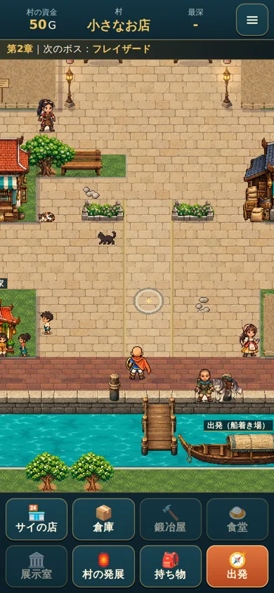
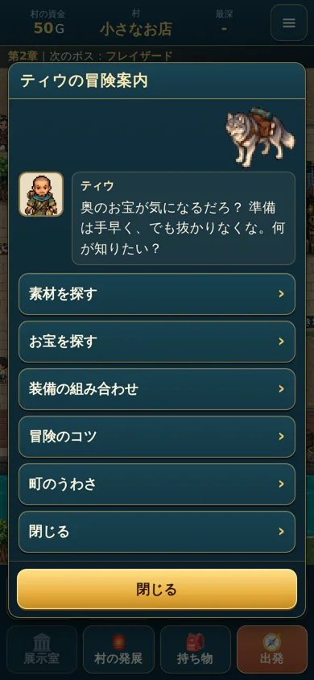
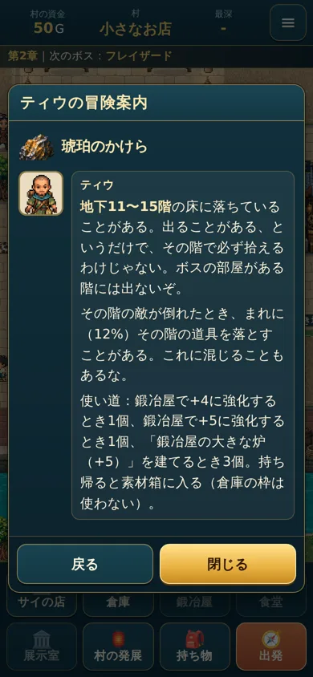
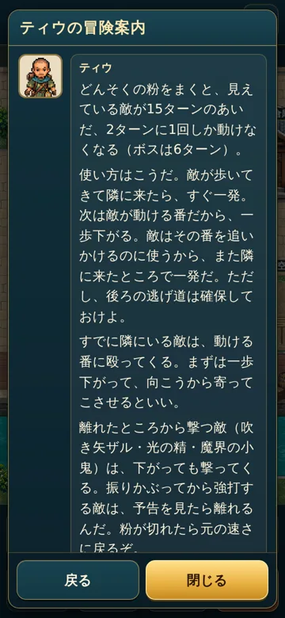

# ティウの冒険案内と、相棒のオオカミ（2026年10月）

## ティウと相棒のオオカミ
- ティウはせっかちで、奥のお宝を早く取りに行きたい人です。冒険の準備や、効率のよい探索に詳しく、実用的な助言をします。
- 表記は「ティウ」に統一しています。
- **相棒のオオカミ:** 名前はまだ決まっていません（付けていません）。
  - 絵は ChatGPT 制作の完成画像です。元の画像は `assets/reference/tiw-wolf-v1/wolf-original.png` にあります。
  - `tools/make-wolf.py` で縮めただけで、描き直していません。透明の背景もそのままです。
  - 大きさは 44×38 で、ティウ（見える高さ47ドット）の約8割の高さです。
- **村での位置:** ティウ (12,21) の右どなり (13,21) です。左（ティウのほう）を向いています。
  - 港への道（20〜21行）のうち、20行はあいています。
  - 桟橋 (10,22)・ティウの左 (11,21)・上 (12,20) もふさいでいません（`tools/tiw-guide-check.js` で道を確かめています）。
  - オオカミのマスは通れません。話しかけると「ティウの相棒のオオカミ。荷物袋を背負って、しっぽをゆらしている。」と出ます。
- **30階の救援:** 荷物を運ぶオオカミも同じ相棒です。届けたときの画面に、同じ絵を出します。
  - 救援の流れ（交換予定 → 終える確認 → OK → 一括で交換・保存 → 配送）は変えていません。
  - 回復は1回だけで、案内からは救援の処理を呼びません。

## 開き方
- 村のティウ本人をタップする（となりまで歩いて開きます）。キー操作でティウのマスへ進んでも開きます。
- 出発画面の「ティウと話す」からも開けます。閉じると出発画面に戻ります。
- 船着き場（桟橋・舟）をタップすると、今までどおり出発画面です。
- 村の会話なので、ダンジョンのターン・満腹度は進みません。開いている間は、後ろの村の移動やタップを受けつけません。

## 中身（`D.STORY.tiwGuide`、画面は `js/ui.js` の `openTiwGuide`）
- **最初の台詞:** 「奥のお宝が気になるだろ？ 準備は手早く、でも抜かりなくな。何が知りたい？」
- **一覧:** 素材を探す／お宝を探す／装備の組み合わせ／冒険のコツ／町のうわさ／閉じる
- **画面の動き**
  - 一覧 → 質問 → 答えの順に進みます。「戻る」で一つ前の一覧へ戻ります。「閉じる」はいつも下に出ています。
  - 長い答えは、答えの欄だけスクロールします。

### 素材・お宝（`G.itemGuide`：実際の出現の表 `D.floorFor`・報酬・鍛冶屋・施設のデータから作る）
- **出る階の調べ方:** 版3の最終章でボスを倒したあとの階として、1〜35階の道具の表を調べます。
- **言い方**
  - 「出ることがある」だけで、「その階で必ず拾える」わけではないと伝えます。
  - ボスの部屋がある階には出ないことも伝えます。
- **敵が落とす:** ふつうの敵は倒れたとき 12%（`D.ENEMY_DROP_RATE`）で、その階の道具の表から1つ落とします。
- **今の章で届かない階:** 「今の章で行けるのは地下○階まで」と添えます。

| 品 | 出ることがある階 | 用途 |
|---|---|---|
| 琥珀のかけら | 地下11〜15階 | 鍛冶屋で+4・+5に強化するとき各1個、鍛冶屋の大きな炉（+5）に3個 |
| 古都の青銅かけら | 地下16〜19階 | +6に強化するとき1個、大きな炉に2個 |
| すいしょうのかけら | 地下21〜25階 | +7に強化するとき1個、黄金の炉（+8）に3個 |
| 神殿の金ぱく | 地下26〜35階 | +8に強化するとき1個、黄金の炉に2個 |
| アユタヤの古金貨 | 地下1〜9階 | 40G・展示室 |
| ひすいの象 | 地下3〜9階 | 120G・展示室 |
| 黄金の蓮 | 地下6〜15階 | 260G・展示室 |
| 琥珀の首飾り | 地下11〜19階 | 300G・展示室 |
| 古都の青銅鐘 | 地下16〜25階 | 420G・展示室 |
| 水の都の王冠 | 地下16〜19階 | 560G・展示室 |
| 大すいしょう | 地下21〜29階 | 700G・展示室 |
| 七色の水晶花 | 地下21〜25階 | 950G・展示室 |
| 黄金の象 | 地下26〜35階 | 1300G・展示室 |
| 夢見の宝冠 | 地下26〜35階 | 2000G・展示室 |

- **章のボスの報酬（クロコダインの涙・氷炎結晶・お宝の竜の紋章）**
  - **そのボスを倒したあとだけ**出します（まだ出会っていないボスの名前を先に明かさないため）。
  - 出すときは「第○章で○○を初めて倒したときの報酬（1回だけ、必ず手に入る）」と案内します。
- **お宝の竜の紋章:** 売れない・展示できないお宝です。「装備できる竜の紋章（アクセサリー）とは別の品」と添えます。
  - アクセサリーの竜の紋章は、お宝の一覧には出しません。「町のうわさ」で案内します。
- **出さない品:** ドラゴニックオーラの盾（竜人王バランがまだ無い）、まだ決まっていない特別な素材。

### 装備の組み合わせ（実装どおり）
- **導入:** 「装備は組み合わせでも化けるんだ。単品の強さだけじゃ、もったいないぞ。」
- 組み合わせは、持っているだけでは効かず、装備して成り立つことを伝えます。
- **5つの組み合わせ**
  - 剣＋紋章：攻撃+5（紋章そのものの+5とは別）。
  - 剣＋盾：正面2マス・貫通2体まで。壁や角の向こうには届きません。
  - 紋章＋盾：防御+5。
  - 3点：2回行動・浮く見た目・ボスの床の印のダメージを受けない・新しい毒と拘束にかからない（今かかっているものは治らない）。
  - 漆黒の盾＋大魔王のローブ：満腹度が減らない・自然回復2倍（4倍にはならない）・攻撃2割減。真魔剛竜剣を装備していれば下がらない。
- 水の上を移動するなど、まだ無い機能は案内しません。

### 冒険のコツ（実際の動きと合っているかを確かめた）
| 質問 | 確かめたこと |
|---|---|
| どんそくの粉はどう使う？ | **正式名称:** どんそくの粉（`slow_powder`）。見えている敵が15ターン、2ターンに1回しか動かない（ボスは6ターン）。 **テスト:** ガマ蛙・ヤミコウモリ・石像の戦士で、「隣に来た直後に一発 → 一歩下がる」をくり返しても、粉が効いている間は一度も殴られませんでした。 ヤミコウモリは2歩動きますが、動いたあとは殴りません。 反対に、隣で殴り続けると殴り返されます。 吹き矢ザルは、粉が効いていても撃ってきます。 この3つを答えに入れています。 |
| その場で早く回復したい | **操作:** 「足踏みボタンを**長押し**」で休み続けます（短く押すと1ターンだけ）。 ダッシュがオンだと1ターンの間隔が 180ms → 60ms になります。ブラウザで約2秒長押しして、12ターン → 34ターンでした。 **回復量:** 1ターンの回復量は同じです（ダッシュのオン・オフで、同じ状態から20ターン休んだHPが一致）。 **止まる条件:** 敵が見えた・HPが満タン・満腹度10以下・毒・できごと。 **回復しないとき:** 毒のあいだと満腹度0では自然回復しません。 **相性のよい装備:** 満腹の腕輪・ファントムマスク、漆黒の盾＋大魔王のローブ（実データで確認）。 |
| 敵が何体も来たら？ | ご指定のまま（細い通路へ下がる）。 |
| 奥まで手早く進みたい | **正式名称:** みとおしの巻物（`sight_scroll`）。 **見えるもの:** その階の地形・階段・落ちている道具とお金（帰還の祠も）。 **見えないもの:** 敵の居場所は出ません（それは気配察知の巻物）。 階の制限は付けていません。 |

### 町のうわさ
- **竜の紋章を拾う前:** 「昔、マスターヤナイが川の向こうで何かなくしたらしいぞ。橋が架かったら、探してみるといい。」
  - 橋の完成前から聞けます。
- **拾ったあと:** 「見つかったんだってな。向こう岸まで探しに行った甲斐があったな！」
  - 拾ったかどうかは `story.found.dragon_crest` で判定します。
- 新しい物語は足していません。

## 掲載を保留したもの
- まだ倒していない章のボスの報酬。
  - 公開の時期は未決定です。今は「倒したあと」だけ出しています。
  - 案：①倒したあと（今の扱い）、②その章に入ったら、③ボスの部屋に入ったら。
- ドラゴニックオーラの盾・竜人王バラン・36〜40階・特別な素材・亀裂の先。
- オオカミの名前。

## 確認
- **ブラウザ（`tools/tiw-guide-check.js`、55項目）:** 幅360・390・430で確かめました。
  - 配置と道。
  - ティウ本人をタップして開くこと、オオカミに話しかけること。
  - 一覧・戻る・閉じる、各項目の中身、はみ出さないこと。
  - 案内中は村が動かないこと。
  - 出発画面から開き、閉じると戻ること。
  - 長押しの休息。
- **ロジック（`tests/logic.test.js` の「ティウの案内」）:** どんそくの粉の動き、休息と回復、みとおしの巻物、入手の階と実データの一致。

   
